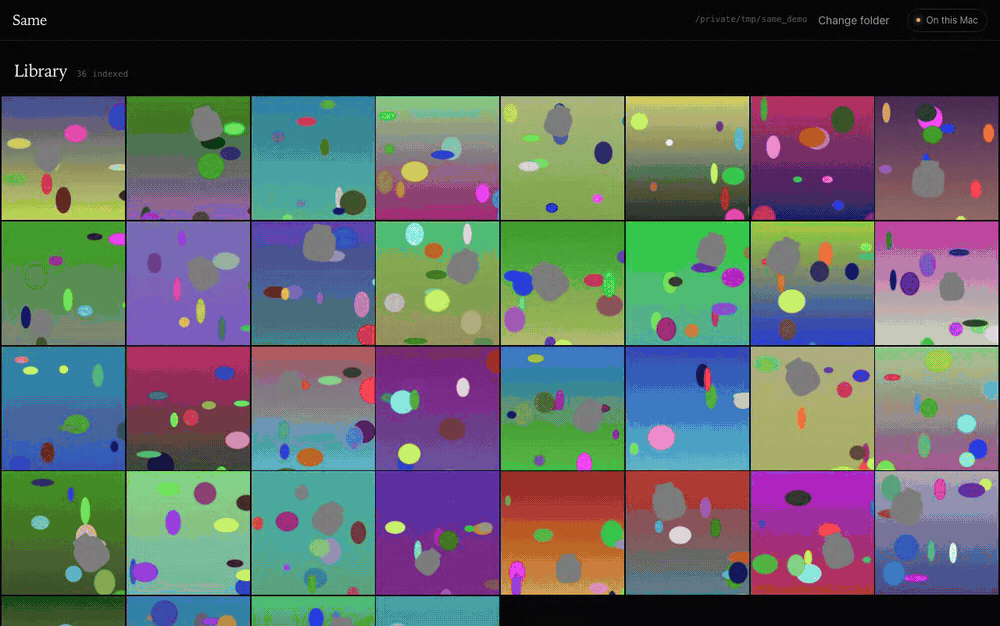

# Same

Tap any object in a photo — a battered teddy bear, your grandfather's watch, your
passport wallet — and see every photo it has ever appeared in, and where you last
saw it. Entirely local: no cloud, and the "no cloud" part is verified by a script,
not by a promise.



*Real capture, real backend: box the object, get every other photo it appears in,
oldest first. Also as [`docs/demo.mp4`](docs/demo.mp4); stills in
[`docs/timeline.png`](docs/timeline.png) and [`docs/selection.png`](docs/selection.png).*

## The problem

Apple Photos recognises *categories* — a toy, a watch, a dog. It has no persistent
identity model for **one specific object** across years, because its index is
class-level. Ask it for your teddy bear and you get teddy bears. Seeing AI's *My
Objects* can learn a specific object, but you have to train it in advance, which
nobody does for the thing they haven't lost yet.

The interesting question is not "is there a mug in this photo" but "is this **my**
mug", and it has to be answerable retroactively, over photos taken before anyone
thought to label anything.

## How it works

A global CLIP-style embedding of a crop returns *other objects of the same class*.
That is a failed product. Same is two stages:

**Stage 1 — recall (`backend/app/indexing/`).** Every image is run once through
`facebook/dinov2-base`. DINOv2's *patch tokens* are self-supervised and
instance-discriminative in a way a CLS token is not, so instead of one vector per
photo we pool them over a 35-region pyramid (1 whole-frame + 9 half + 25 quarter
windows, overlapping) and index all 35 in hnswlib. That pyramid is what lets a
wallet occupying 7% of a frame be found at all. Stage 1 is deliberately
permissive: it returns *candidates*.

**Stage 2 — precision (`backend/app/retrieval/verify.py`).** Every candidate is
matched to the query crop with SIFT + FLANN + Lowe's ratio test, then RANSAC asks
whether those correspondences agree on **one** rigid 2-D transform. Two different
teddy bears throw plenty of ratio-test matches — same silhouette, same fur
statistics — but the matches land in geometrically incoherent places and no
consensus forms. That gap is the entire discriminator. The inlier count is passed
to the UI as the confidence, unlaundered.

```
accept  ⟺  inliers ≥ 30   or   (inliers ≥ 6 and inliers / ratio-test-matches ≥ 0.45)
```

Two gates, because a raw inlier count is not scale-invariant: a textured object
filling 30% of the frame yields 100–170 inliers, the same pipeline on a flat
blurred object yields 8–20, and no single absolute threshold keeps the second
while rejecting lookalikes of the first. The fraction does. Both numbers come
from a sweep over 3,408 labelled candidate pairs plus real 4K footage — see
"Choosing the operating point" below.

## Measured results

Ground truth is exact: `backend/app/retrieval/evalset.py` composites three
instances of one class (same silhouette, *different surface*) into random scenes.
Instance A must be returned; B and C must not. That is the whole test.

Numbers below are **through the running HTTP API**, over one 72-photo index
holding both suites at once, so every query faces same-class traps from both.
Reproduce them with `backend/app/retrieval/http_eval.py` (see "Checks"): 8
leave-one-out queries per suite, 7 true positives each, so 56 per suite.

| suite | recall | same-class-different-instance accepted | unrelated accepted | median latency |
|---|---|---|---|---|
| easy (object ≈30% of a 1600px frame, textured) | **56/56 = 1.000** | **0** / 128 | 0 / 384 | 0.29 s |
| hard (16%, flat surface, blurred, JPEG q55, 25% occluded) | 25/56 = 0.446 | 1 / 128 | 0 / 384 | 0.29 s |
| hard, after confirming returned matches | **34/56 = 0.607** | 1 / 128 | 0 / 384 | 0.29 s |

The module's own leave-one-out harness (`retrieval/eval.py`, 8 queries per suite)
agrees and adds the small-object case:

| suite | same instance accepted | same class, different instance | unrelated |
|---|---|---|---|
| easy | 56/56 = **1.000** | **0** / 128 | 0 / 96 |
| **small** (object at 7% of the frame, ≈110 px) | 56/56 = **1.000** | **0** / 128 | 0 / 96 |
| hard | 13–20 / 56 = 0.23–0.36 | **0** / 128 | 0 / 96 |
| hard, after confirming | 19–39 / 56 = 0.34–0.70 | **0** / 128 | 0 / 96 |

Small-object recall of 1.000 at 7% of frame width is the region pyramid earning
its keep — a whole-image embedding cannot find that object at all. The hard suite
is quoted as a **range across identical runs**: with only 4–6 correspondences to
work with, which ones RANSAC happens to sample decides the outcome, and that
instability is a real property of the case, not measurement sloppiness.

*Same-class-different-instance acceptance is 0 on every suite except `hard`,
where it is 1 in 128.* That single failure is worth naming: querying `hard/A_01`
accepts `hard/C_00` — a different instance of the same class — at exactly 6
inliers, which is `MIN_INLIERS`. On a flat blurred surface the true and false
match distributions are close enough to touch at the operating point, so the
gate that is comfortable on `easy` is sitting on the edge on `hard`. Raising
`MIN_INLIERS` to 7 removes it and costs recall; the trade has not been made.

Stage 1 alone gives P@5 = 0.18–0.38 depending on suite, and nearly every one of
its errors is the right class and the wrong object — which is exactly why
stage 2 exists.

**Real photographs.** 30 frames sampled from a real 4K video (rain, night, heavy
compression): boxing one specific building in frame 0 returns **28–29 of the 29
other frames**, every returned box on that same building. 183 real photos and
video frames from a personal library index at 2.73 img/s; queries run at 0.69 s
median, 3.1 s worst case.

**Where it fails, honestly.** The `hard` suite recalls 0.34–0.45. SIFT finds ~24
keypoints on a flat blurred surface and you cannot RANSAC a consensus out of
nothing; confirming a couple of sightings recovers half the gap, but the real
upgrade is a learned matcher (SuperPoint + LightGlue, or LoFTR) at the
`verify.py` seam. RANSAC also samples randomly, so a candidate sitting on the
gate can flip between runs — the 29th video frame does exactly that.

## Choosing the operating point

Both thresholds were moved during integration, on evidence, and both changes are
recorded in the code:

* **`STRONG_INLIERS` 20 → 30.** Two *degraded* unrelated scenes reached 20 and 24
  inliers at a high inlier fraction, so no fraction floor could exclude them —
  only the count could. 30 costs zero recall and halves the false positives.
* **`MIN_INLIER_FRACTION` 0.40 → 0.45**, after the scale fix below: identical
  recall, and it removes the one same-class false positive 0.40 let through.

The fix that mattered most was not a threshold. Indexed photos have their SIFT
computed at `SIFT_MAX_SIDE = 1024`, so a 3840 px frame is seen 3.75× smaller than
life — while the query crop was being detected at native pixels. Two different
levels of detail, and the ratio test degenerates: on real 4K footage **true**
matches came back at inlier fraction 0.24–0.38, under the accept gate, and the
product returned *nothing* for an object plainly there. Rendering the crop at the
same effective scale as the index moved those same matches to 0.62–0.72:
**0 → 29 correct matches.** For photos at or below 1024 px nothing changes.

## The gesture

Selecting the object is the one thing the user does by hand, so it is adjustable
rather than one-shot: drag anywhere on the photo to draw a box, drag its edges or
corners to reshape it, drag inside it to slide it, arrow keys to nudge by a pixel
(hold ⌥ for ten, ⇧ to pull the far corner), `Esc` to clear, `Return` to search.
Every edge has a 12 px grab margin, so the pointer never has to find a hairline.

A settled selection is searched **in the background, 260 ms after you stop
moving**, and "Find this object" then usually resolves in a frame. It is the same
query with the same result — started earlier, not faked. Re-running it after
feedback never reuses a warm answer, because feedback changes the answer.

## Two of the same mug

Two identical manufactured items **will** match each other, and no amount of
texture matching can separate them, because they genuinely look the same. Same
does not pretend otherwise:

* Where there is evidence, it says so. `verify_all()` re-runs RANSAC on the
  correspondences left over after the first fit, so **two non-overlapping verified
  detections in one photo is proof** you own two, and `duplicate_warning()`
  surfaces it — including the consequence, which is that "last seen" is then the
  last time *any* copy was photographed.
* Where there is no evidence — twins that never share a frame — Same stays silent
  rather than guessing.
* The confirm/reject control is the separator. Rejecting a sighting blacklists
  that photo for that object permanently; confirming one adds it as an extra view.

## Privacy, verified

No network call is made at index time or query time. Not "shouldn't be" —
`from_pretrained` contacts huggingface.co on *every* load, even with weights
cached, so `Embedder` passes `local_files_only` unless you explicitly opt in to
the one-time download. To check rather than trust:

```bash
uv run python scripts/verify_offline.py
#   socket.connect calls during index + query: 0
#   OK: nothing left this machine.
```

It installs a CPython audit hook on `socket.connect`, runs a real index pass and a
real query, and fails on any non-loopback address. The server binds `127.0.0.1`
only; the frontend loads no webfonts, no CDN scripts, no analytics; and locations
are shown as raw coordinates because a place name would mean sending your
location to a map service.

## Run it

```bash
uv venv --python 3.12 && uv sync
cd frontend && npm install && cd ..

# one-time model download (~350 MB); the only network access Same ever needs
SAME_ALLOW_MODEL_DOWNLOAD=1 uv run python -c \
  "from backend.app.indexing import Embedder; Embedder()"

uv run uvicorn backend.app.main:app --host 127.0.0.1 --port 8000   # terminal 1
cd frontend && npm run dev                                         # terminal 2
```

Open the printed Vite URL, paste an absolute folder path, and index. Point it at
a different backend port with `SAME_API=http://127.0.0.1:8011 npm run dev`.

A labelled demo set (target instance + same-class traps + unrelated scenes):

```bash
uv run python -m backend.app.retrieval.evalset easy sample_photos
```

Checks:

```bash
uv run python -m backend.app.indexing.selfcheck      # index round-trip, ~30 s
uv run python -m backend.app.retrieval.selfcheck     # same instance in, same class out
uv run python -m backend.app.retrieval.eval          # full precision/recall, ~90 s
```

The headline table above is measured through the HTTP API, so it needs a server.
`--build` renders both suites and indexes them; drop it on later runs:

```bash
SAME_INDEX_DIR=/tmp/same_http/index \
  uv run uvicorn backend.app.main:app --host 127.0.0.1 --port 8000   # terminal 1

SAME_INDEX_DIR=/tmp/same_http/index \
  uv run python -m backend.app.retrieval.http_eval --build           # terminal 2
uv run python -m backend.app.retrieval.http_eval
```

## Layout

| path | what |
|---|---|
| `backend/app/schemas.py` | the shared Pydantic contract; boxes are normalised xyxy, origin top-left |
| `backend/app/indexing/` | scanning, video frame sampling, EXIF, DINOv2 regions, hnswlib, SIFT cache |
| `backend/app/retrieval/` | verification, the two-stage query, the confirm/reject object store, eval harness |
| `backend/app/api/` | FastAPI routes; one process-wide `Searcher` (constructing one loads DINOv2) |
| `frontend/src/` | Vite + React + TS; crop gesture, chronological timeline, last-seen |
| `backend/app/retrieval/http_eval.py` | the headline table, as a runnable check against a live server |
| `scripts/verify_offline.py` | the privacy claim, as a runnable check |
| `docs/` | demo recording and stills |

## Costs and limits

* **Index size ≈ 280 KB/photo** (region vectors + hnswlib's own float32 copy),
  plus a lazily-built SIFT cache of ~520 KB per 12 MP photo. Roughly 40 GB for
  50k photos. Levers: fewer fine-scale regions, or PCA 768 → 256.
* **Throughput**: 13 img/s on 1600 px images, 2.7 img/s on a real mixed library of
  12 MP HEIC/JPEG plus video decoding (M-series, MPS). Re-indexing is incremental
  — unchanged files cost one `stat()`.
* **Query latency**: 0.23–0.7 s median. Stage 2 verifies up to 200 candidates in a
  thread pool; that is the whole cost, and it is flat in library size beyond 200.
  The *first* query used to cost 3.13 s because it also loaded DINOv2 and compiled
  the MPS kernels; the server now does that on a daemon thread at startup. Measured
  in the browser, click → first row on screen: **1.32 s** on a two-second-old
  server, **0.04 s** in normal use, where the background search has already run.
* **Two DINOv2 forward passes at once deadlocked** inside SDPA attention on MPS
  and wedged the process permanently — no error, no timeout. It was reachable
  from ordinary use (two overlapping searches, or a search during an index run)
  and the background search made it routine. `backend/app/indexing/features.py`
  now takes a process-wide lock around the only code that touches the device.
  Six simultaneous queries: all 200, 0.28–1.34 s, serialised at ~215 ms each.
  The lock costs nothing — one GPU could not have run them in parallel anyway.
* The evaluation suites cover instance-vs-class, scale, texture, blur, occlusion
  and duplicates. They do **not** cover 3-D viewpoint change, and the real-photo
  test above is a locked-off camera. Treat viewpoint robustness as unproven.
* Every query creates an object record in `.index/objects.json`, even if the user
  never gives feedback. Harmless (~200 bytes), untidy, unfixed.

## Attribution and license

Same's code is MIT-licensed (`LICENSE`). It loads, unmodified, one pretrained
model:

* **DINOv2** ([Oquab et al., Meta AI Research, 2023](https://arxiv.org/abs/2304.07193)),
  `facebook/dinov2-base` weights via Hugging Face `transformers`, Apache 2.0.
  Same only reads its patch-token activations; no fine-tuning is done and no
  DINOv2 code is vendored.

Stage 2 uses OpenCV's SIFT and FLANN implementations (Apache 2.0 since
OpenCV 4.4; SIFT's original patent expired in 2020). No other third-party
model or weights are used.
